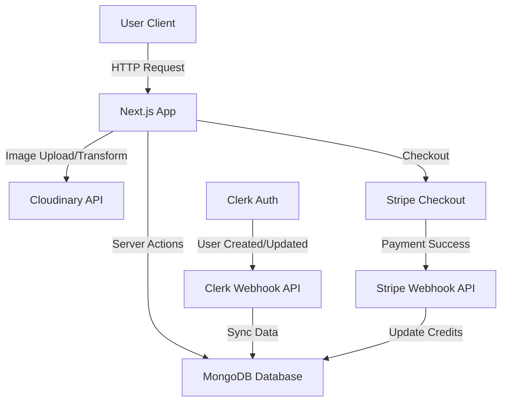

# Pixa - AI Image Transformation SaaS

 

**Pixa** is a powerful SaaS application that empowers users to transform their images using advanced AI capabilities. Built with **Next.js 15**, it offers features like generative fill, object removal, background removal, and image restoration, all integrated within a seamless credit-based economy.

---

## 🚀 Features

- **🔐 Secure Authentication**: Powered by **Clerk**, providing safe and easy sign-in/sign-up with Google, GitHub, and email.
- **🖼️ AI Transformations**:
    - **Generative Fill**: Add content to images based on text prompts.
    - **Object Removal**: Cleanly remove unwanted objects.
    - **Background Removal**: Instantly extract subjects.
    - **Image Restoration**: Fix blurry or old photos.
- **💰 Credit System**: Integrated **Stripe** payment gateway for purchasing credits to perform transformations.
- **🔍 Advanced Search**: Find your images quickly using metadata and content search (Cloudinary + MongoDB).
- **📱 Responsive UI**: A mobile-first, beautiful interface built with **Tailwind CSS** and **Shadcn/UI**.
- **☁️ Cloud Storage**: Secure image hosting and management with **Cloudinary**.

---

## 🛠️ Tech Stack

### Frontend
- **Framework**: [Next.js 15](https://nextjs.org/) (App Router)
- **Language**: TypeScript
- **Styling**: Tailwind CSS, Shadcn/UI (Radix Primitives)
- **Form Handling**: React Hook Form + Zod

### Backend
- **Server**: Next.js Server Actions
- **Database**: MongoDB (Mongoose ORM)
- **Image Processing**: Cloudinary AI
- **Payments**: Stripe
- **Auth**: Clerk

### Quality Assurance
- **Monitoring**: Sentry (Error Tracking & Performance)
- **Testing**: Playwright (End-to-End Testing)

---

## 🏗️ Architecture

The application follows a modern serverless architecture using Next.js Server Actions for backend logic. Webhooks ensure data consistency between third-party services (Clerk, Stripe) and the internal MongoDB database.



---

## 💻 How to Run Locally

Follow these steps to set up the project on your local machine.

### Prerequisites
- Node.js (v18+)
- MongoDB Atlas Account
- Cloudinary Account
- Clerk Account
- Stripe Account

### 1. Clone the Repository
```bash
git clone https://github.com/skjaiswal88/pixa.git
cd pixa
```

### 2. Install Dependencies
```bash
npm install
# or
yarn install
```

### 3. Set Up Environment Variables
Create a `.env.local` file in the root directory and add the following keys:

```env
# MongoDB
MONGODB_URL=mongodb+srv://<username>:<password>@cluster0.mongodb.net/pixa

# Clerk (Authentication)
NEXT_PUBLIC_CLERK_PUBLISHABLE_KEY=pk_test_...
CLERK_SECRET_KEY=sk_test_...
WEBHOOK_SECRET=whsec_... # From Clerk Webhook Dashboard

# Cloudinary (Image Processing)
NEXT_PUBLIC_CLOUDINARY_CLOUD_NAME=...
CLOUDINARY_API_KEY=...
CLOUDINARY_API_SECRET=...

# Stripe (Payments)
STRIPE_SECRET_KEY=sk_test_...
STRIPE_WEBHOOK_SECRET=whsec_... # From Stripe Webhook Dashboard
NEXT_PUBLIC_STRIPE_PUBLISHABLE_KEY=pk_test_...

# App URL
NEXT_PUBLIC_SERVER_URL=http://localhost:3000
```

### 4. Run the Development Server
```bash
npm run dev
```
Open [http://localhost:3000](http://localhost:3000) in your browser.

### 5. Run Tests
Verify the application is working correctly by running the End-to-End test suite.
```bash
npx playwright test
```

---

## 🗝️ Key Achievements & Technical Highlights

### 1. **High-Performance & SEO Optimized**
Building a rich SaaS application often compromises speed, but Pixa was designed for performance from day one.
- *Achievement*: Developed a modern full-stack architecture that achieves a **91 Lighthouse Performance score** and a **perfect 100 SEO score**.
- *Tech*: Optimized Next.js App Router caching, image optimization, and efficient bundle splitting.

### 2. **Complex AI Integration**
Delivering varied AI capabilities without overwhelming the client-side.
- *Achievement*: Successfully powered 5 core image transformation features (generative fill, object/background removal, recoloring, and restoration).
- *Solution*: Integrated **Cloudinary’s AI APIs** for server-side processing and optimized content delivery, contributing to a **Largest Contentful Paint (LCP) of just 1.2 seconds**.

### 3. **Secure Financial & User Operations**
Managing user credits and authentication across distributed systems.
- *Solution*: Constructed a seamless system by integrating **Clerk** for auth and **Stripe** for payments. utilized **secure webhooks** to automate real-time synchronization between Stripe events (purchases) and the MongoDB database, ensuring users receive credits instantly.

### 4. **Deep Federated Search**
Finding images based on content rather than just simple text tags.
- *Solution*: Designed an advanced federated search system that first queries **Cloudinary’s media-native search API** (to find images by AI-tag/content), and then uses those results to perform a targeted and efficient lookup in **MongoDB** for associated application metadata.

### 5. **Robust CI/CD & DevOps**
Ensuring code quality and reliability through automated pipelines.
- *Achievement*: Implemented a full **CI/CD pipeline using GitHub Actions** that automatically builds, lints, and tests every commit.
- *Testing*: Integrated **Playwright** for End-to-End (E2E) testing to verify critical user flows before deployment.
- *Monitoring*: Deployed **Sentry** for real-time error tracking and performance monitoring in production.

### 6. **Social Media & SEO Optimized**
- *Achievement*: Configured dynamic **Open Graph (OG)** tags and Twitter Cards, ensuring that links shared on social platforms (WhatsApp, LinkedIn, Twitter) display a professional preview with the brand logo and description.

## ⚡ CI/CD Pipeline

The project uses **GitHub Actions** for Continuous Integration.
- **Trigger**: Pushes to `master` and Pull Requests.
- **Jobs**:
    1.  **Build & Lint**: Verifies strict type safety (TypeScript) and code style.
    2.  **Test**: Runs the Playwright E2E suite against a headless browser.

## 📈 Monitoring & Quality Assurance

- **Sentry**: Connected to the Next.js App Router to capture server-side exceptions and client-side rendering errors.
- **Playwright**: Automates the testing of:
    - Landing page availability.
    - Authentication redirects.
    - Critical UI element visibility.
