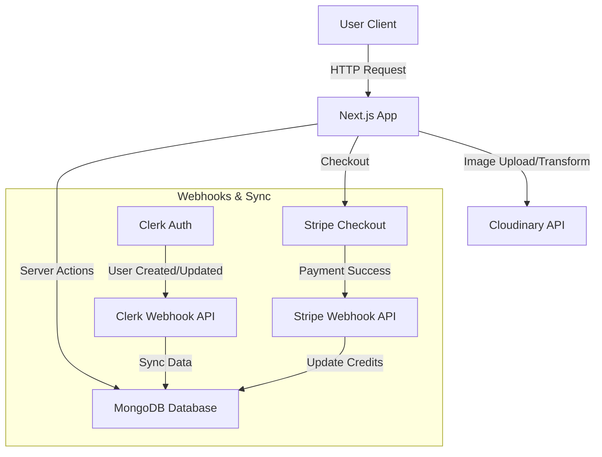

# Pixa - AI Image Transformation SaaS

 

**Pixa** is a powerful SaaS application that empowers users to transform their images using advanced AI capabilities. Built with **Next.js 15**, it offers features like generative fill, object removal, background removal, and image restoration, all integrated within a seamless credit-based economy.

---

## 🚀 Features

- **🔐 Secure Authentication**: Powered by **Clerk**, providing safe and easy sign-in/sign-up with Google, GitHub, and email.
- **🖼️ AI Transformations**:
    - **Generative Fill**: Add content to images based on text prompts.
    - **Object Removal**: Cleanly remove unwanted objects.
    - **Background Removal**: Instantly extract subjects.
    - **Image Restoration**: Fix blurry or old photos.
- **💰 Credit System**: Integrated **Stripe** payment gateway for purchasing credits to perform transformations.
- **🔍 Advanced Search**: Find your images quickly using metadata and content search (Cloudinary + MongoDB).
- **📱 Responsive UI**: A mobile-first, beautiful interface built with **Tailwind CSS** and **Shadcn/UI**.
- **☁️ Cloud Storage**: Secure image hosting and management with **Cloudinary**.

---

## 🛠️ Tech Stack

### Frontend
- **Framework**: [Next.js 15](https://nextjs.org/) (App Router)
- **Language**: TypeScript
- **Styling**: Tailwind CSS, Shadcn/UI (Radix Primitives)
- **Form Handling**: React Hook Form + Zod

### Backend
- **Server**: Next.js Server Actions
- **Database**: MongoDB (Mongoose ORM)
- **Image Processing**: Cloudinary AI
- **Payments**: Stripe
- **Auth**: Clerk

---

## 🏗️ Architecture

The application follows a modern serverless architecture using Next.js Server Actions for backend logic. Webhooks ensure data consistency between third-party services (Clerk, Stripe) and the internal MongoDB database.



---

## 💻 How to Run Locally

Follow these steps to set up the project on your local machine.

### Prerequisites
- Node.js (v18+)
- MongoDB Atlas Account
- Cloudinary Account
- Clerk Account
- Stripe Account

### 1. Clone the Repository
```bash
git clone https://github.com/skjaiswal88/pixa.git
cd pixa
```

### 2. Install Dependencies
```bash
npm install
# or
yarn install
```

### 3. Set Up Environment Variables
Create a `.env.local` file in the root directory and add the following keys:

```env
# MongoDB
MONGODB_URL=mongodb+srv://<username>:<password>@cluster0.mongodb.net/pixa

# Clerk (Authentication)
NEXT_PUBLIC_CLERK_PUBLISHABLE_KEY=pk_test_...
CLERK_SECRET_KEY=sk_test_...
WEBHOOK_SECRET=whsec_... # From Clerk Webhook Dashboard

# Cloudinary (Image Processing)
NEXT_PUBLIC_CLOUDINARY_CLOUD_NAME=...
CLOUDINARY_API_KEY=...
CLOUDINARY_API_SECRET=...

# Stripe (Payments)
STRIPE_SECRET_KEY=sk_test_...
STRIPE_WEBHOOK_SECRET=whsec_... # From Stripe Webhook Dashboard
NEXT_PUBLIC_STRIPE_PUBLISHABLE_KEY=pk_test_...

# App URL
NEXT_PUBLIC_SERVER_URL=http://localhost:3000
```

### 4. Run the Development Server
```bash
npm run dev
```
Open [http://localhost:3000](http://localhost:3000) in your browser.

---

## 🗝️ Key Challenges Solved

### 1. **Robust Webhook Synchronization**
Keep user data in sync across systems was critical. We implemented secure webhooks for **Clerk** (user creation) and **Stripe** (payments).
- *Solution*: A robust webhook handler (`api/webhooks/...`) verifies signatures (using `svix` for Clerk and `stripe` SDK) before safely updating the MongoDB database to ensure the local user record matches the external provider state.

### 2. **Secure Credit System**
Preventing unauthorized usage was a priority.
- *Solution*: Implemented optimistic UI updates for better UX but strictly validated credit balances on the server (Server Actions) before authorizing any Cloudinary transformation request.

### 3. **Efficient Search & Pagination**
Searching through thousands of images with complex filters (tags, titles, types).
- *Solution*: Leveraged Cloudinary's Search API for handling queries (`expression`) and mapped the results back to MongoDB records for metadata consistency and pagination, creating a snappy search experience.
